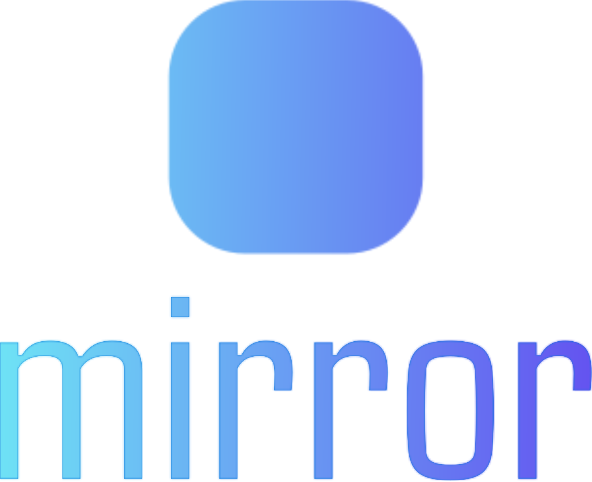

<!--lint disable no-literal-urls-->
<br/>
<br/>
<div align="center">
   
</div>
<br/>
<br/>
<br/>
<div align="center">
  <strong>Cross-platform casting SDK, support Android, Windows, Linux</strong>
</div>
<div align="center">
  
  
  
  
</div>
<br/>
<br/>

Pure software screen projection is different from Miracast, AirPlay, etc., which need to rely on hardware support. This project was not designed to work on a wide area network, but works well in a local area network environment.

## Features

-   Audio is transmitted using OPUS raw streaming.
-   Video encoding uses H264, supports QSV, NVENC hardware accelerated encoding and decoding.
-   Supports UDP multicast and [SRT](https://github.com/Haivision/srt), and can dynamically switch the transport layer.
-   Work in an unstable network environment (such as high-QOS WIFI).

## Build Instructions

#### Requirements

[Git](https://git-scm.com/downloads) | [Rust](https://www.rust-lang.org/tools/install) | [CMake](https://cmake.org/download/) | [Python3](https://www.python.org/downloads/) | [Node.js](https://nodejs.org/en/download)

-   C++20 or above compliant compiler.
-   Rust stable toolchain.
-   CMake 3.16 or above as a build system.
-   Node.js 16 or above as a auto build script.
-   Python3 is optional and required for Android Studio projects.

##### Linux (Ubuntu/Debian)

> For Linux, you need to install additional dependencies to build SRT and other.

```sh
sudo apt-get update
sudo apt-get install tclsh pkg-config cmake libssl-dev build-essential libasound2-dev libdrm-dev libgbm-dev libvulkan1 libvulkan-dev
```

---

#### Build

Examples and SDK library files can be automatically packaged by running an automatic compilation script.

```sh
npm run build
```

The Debug version is compiled by default. If you need the Release version, just run `npm run build:release`.  
For android, there is no need to manually call compilation. You can directly use Android Studio to open [./examples/android](./examples/android).

If you don't need to build the examples, just build the dynamic library:

```sh
cargo build --release
```

For the required header files: [mirror.h](./ffi/include/mirror.h)

## License

[GPL](./LICENSE) Copyright (c) 2024 Lazy Panda.
